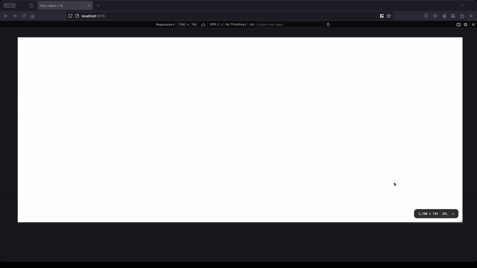

# Screen Size Overlay


**Screen Size Overlay** is a lightweight React component that displays the **current screen width and height**, shows distances to the previous and next breakpoints, and supports presets (`Tailwind`, `Bootstrap`, `Foundation`, `Bulma`, `MUI`) or fully custom configurations. Perfect for rapid debugging and ensuring responsive layouts.

Easy to integrate into any `React` or `Next.js` project.

<p>
  
</p>

## 🚀 Key Features

- **Lightweight**: The library is less than **3KB** (gzip). No dependencies.
- **Framework-Independent**: Pure CSS approach—no specific CSS framework required.
- **Real-Time Screen Dimensions**: Instantly displays current screen width and height.
- **Multiple Presets**: Built-in support for Tailwind CSS, Bootstrap (4/5), Foundation, Bulma and MUI breakpoints.
- **Dark Mode Support**: Adapts automatically to dark mode when applicable.
- **Customizable**: Easily supply your own custom breakpoints or pass a custom theme object.
- **Responsive Testing Made Easy**: Ideal for developers fine-tuning adaptive and responsive designs.

## 📦 Installation

Install the package using your preferred package manager:

```bash
# Using npm
npm install screen-size-overlay

# Using yarn
yarn add screen-size-overlay

# Using pnpm
pnpm add screen-size-overlay
```

## 💻 Usage

### Example with React.js

A simple approach to adding `ScreenSizeOverlay` in a React application:

```tsx
import React from 'react'
import { ScreenSizeOverlay } from 'screen-size-overlay'

export default function App() {
  return (
    <div>
      <h1>Welcome to my App</h1>
      {/* Overlay visible only in development */}
      <ScreenSizeOverlay enable={process.env.NODE_ENV === 'development'} />
      {/* Or conditionally */}
      {process.env.NODE_ENV === 'development' && <ScreenSizeOverlay />}
    </div>
  )
}
```

### Example with React.lazy

If you want to load the component lazily in a standard React app, you can use `React.lazy`:

```tsx
import React, { lazy, Suspense } from 'react'

// Lazy-load the overlay component
const ScreenSizeOverlay = lazy(() =>
  import('screen-size-overlay').then((module) => ({
    default: module.ScreenSizeOverlay,
  }))
)

export default function App() {
  return (
    <div>
      <h1>My React App</h1>
      <Suspense fallback={<div>Loading overlay...</div>}>
        {process.env.NODE_ENV === 'development' && <ScreenSizeOverlay />}
      </Suspense>
    </div>
  )
}
```

**Note:** Make sure to wrap the lazy-loaded component in a <Suspense> boundary to handle the fallback UI while the overlay is being loaded.

### Example with Next.js

In a `Next.js` project, you can dynamically load the overlay and display it only in development mode:

```tsx
import React from 'react'
import dynamic from 'next/dynamic'

const ScreenSizeOverlay = dynamic(() =>
  import('screen-size-overlay').then((module) => module.ScreenSizeOverlay)
)

export default function App() {
  return (
    <>
      <h1>Your Application</h1>
      {process.env.NODE_ENV === 'development' && <ScreenSizeOverlay />}
    </>
  )
}
```

## ⚙️ Customization

Below is a more detailed example demonstrating the various props:

```tsx
<ScreenSizeOverlay
  // Controls whether the overlay is visible (default: true).
  // Useful if you only want the overlay active in development mode.
  enable={process.env.NODE_ENV === 'development'}
  // Breakpoints used to determine the current responsive behavior.
  // By default, Tailwind CSS breakpoints are used.
  breakpoints="tailwind" // Use preset 'tailwind', 'bootstrap', 'bootstrap4', 'bootstrap5', 'foundation', 'bulma', 'mui' or provide custom breakpoints
  // Example of custom breakpoints:
  // breakpoints={{
  //   XS: [0, 639],
  //   SM: [640, 767],
  //   MD: [768, 1023],
  //   LG: [1024, 1279],
  //   XL: [1280, 1535],
  //   '2XL': [1536, Infinity],
  // }}

  // Position of the overlay on the screen: 'top-left' | 'top-right' | 'bottom-left' | 'bottom-right' | 'relative' (by default 'bottom-right')
  position="bottom-right"
  // Size of the overlay: 'sm' | 'md' | 'lg' | 'xl'| '2xl' (default: 'lg')
  size="lg"
  // If true, displays distance to the previous breakpoint (default: true)
  showPrevBreakpoint={true}
  // If true, displays distance to the next breakpoint (default: true)
  showNextBreakpoint={true}
  // If false, hides the close button in the overlay (default: true)
  showCloseButton={false}
  // Transparency level of the overlay. A value between 0 (fully transparent) and 1 (fully opaque)
  transparency={0.95} // (default: 1)
  // Theme can be one of: 'light' | 'dark' | 'scheme' | 'class' | CustomTheme (by default 'scheme')
  // theme="dark"

  // If you want a fully customized color scheme,
  // pass a theme object instead of a preset value:
  theme={{
    backgroundColor: '#005204', // Overlay background color
    borderColor: '#032b00', // Overlay border color
    textColor: '#ffffff', // Overlay text color
    separatorColor: '#2e7400', // Color for separators between displayed info
    closeButtonColor: '#2e7400', // Color for the close button (if showCloseButton=true)
    fontFamily: 'Arial, sans-serif', // Font family for all text in the overlay
  }}
/>
```

## 📝 License

This project is licensed under the [MIT License](https://opensource.org/licenses/MIT). Feel free to use it in your projects.
