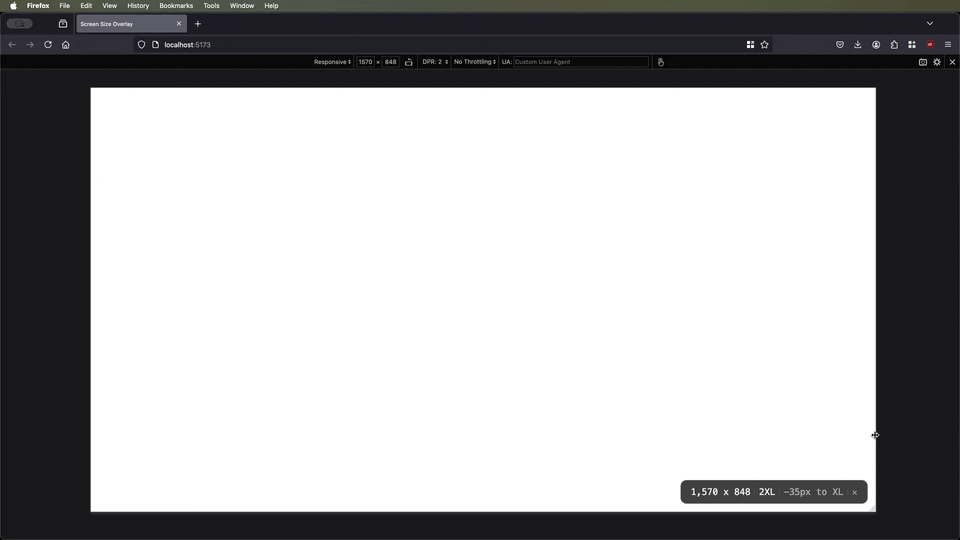

# Screen Size Overlay

> Perfect for debugging screen size changes in responsive layouts. Easy to integrate into any `React` or `Next.js` project.

<p>

</p>
<p>

</p>
<p>

</p>

**Screen Size Overlay** is a lightweight React component that displays the `current screen size` (width and height), shows distances to the previous and next breakpoints. Supports presets (`Tailwind CSS`, `Bootstrap`, `Foundation`, `Bulma`, `MUI`) or fully custom configurations. By default, **screen-size-overlay** uses `Tailwind CSS` breakpoints.

You can also build a fully custom overlay by using the library’s hooks such as `useWindowSize` and `useBreakpointInfo` to retrieve screen dimensions and breakpoint data.

<p>
  
</p>

## 🚀 Key Features

- **Lightweight**: The library is less than **5KB** (gzip). No dependencies.
- **Framework-Independent**: Pure CSS approach, no specific CSS framework required.
- **Real-Time Screen Dimensions**: Instantly displays current screen width and height.
- **Multiple Presets**: Built-in support for `Tailwind CSS`, `Bootstrap (4/5)`, `Foundation`, `Bulma` and `MUI` breakpoints. You can also provide your own `custom breakpoints`.
- **Theme Options and Dark Mode Support**: Pass either a single theme (for a universal style) or a dual-theme object (light/dark) with various switching modes.

  - `manual`: Toggle light/dark themes via a button.
  - `scheme`: Follows the OS color scheme (prefers-color-scheme).
  - `class`: Detects a class (e.g., 'dark') on `<html>` or `<body>`.

- **Customizable**: Includes Teal, Green, Blue, Purple, Orange, and more—each with Light/Dark variants. Extend or merge them as needed. Override container/overlay styles, toggle breakpoint distances, or provide single/dual themes with manual or automatic dark mode switching.
- **Locales and Languages**:

  - `locale` for number formatting (e.g., `en-US`, `ru-RU`, `es-ES`).
  - `language` for UI translations (`en`, `ru`, `es`).

- **Modes: `visible`, `auto-hide`, `auto-compact`**:

  - `visible`: Always on.
  - `auto-hide`: Appears on resize, then fades out after displayDuration.
  - `auto-compact`: Minimal label view, expands on hover or resize.

- **Throttle for Performance**: Limit resize updates with an optional `throttleDelay` (default `100ms`).
- **Hooks for a Custom Overlay**  
  Exported hooks like `useWindowSize` and `useBreakpointInfo` let you build **any** custom overlay component, fully independent of the default UI.

## 📦 Installation

Install the package using your preferred package manager:

```bash
# Using npm
npm install screen-size-overlay

# Using yarn
yarn add screen-size-overlay

# Using pnpm
pnpm add screen-size-overlay

# Using bun
bun add screen-size-overlay
```

## 💻 Using Screen Size Overlay to monitor screen width and height

### Example of using screen-size-overlay with React.js

A simple approach to adding `ScreenSizeOverlay` in a React application:

```tsx
import React from 'react'
import { ScreenSizeOverlay } from 'screen-size-overlay'

export default function App() {
  return (
    <div>
      <h1>Welcome to my App</h1>
      {/* Overlay visible only in development */}
      <ScreenSizeOverlay enable={process.env.NODE_ENV === 'development'} />
      {/* Or conditionally */}
      {process.env.NODE_ENV === 'development' && <ScreenSizeOverlay />}
    </div>
  )
}
```

### Example with React.lazy

If you want to load the component lazily in a standard React app, you can use `React.lazy`:

```tsx
import React, { lazy, Suspense } from 'react'

// Lazy-load the overlay component
const ScreenSizeOverlay = lazy(() =>
  import('screen-size-overlay').then((module) => ({
    default: module.ScreenSizeOverlay,
  }))
)

export default function App() {
  return (
    <div>
      <h1>My React App</h1>
      <Suspense fallback={<div>Loading overlay...</div>}>
        {process.env.NODE_ENV === 'development' && <ScreenSizeOverlay />}
      </Suspense>
    </div>
  )
}
```

**Note:** Make sure to wrap the lazy-loaded component in a `<Suspense>` boundary to handle the fallback UI while the overlay is being loaded.

### Screen Size Overlay with Next.js

In a `Next.js` project, you can dynamically load the overlay and display it only in development mode:

```tsx
import React from 'react'
import dynamic from 'next/dynamic'

const ScreenSizeOverlay = dynamic(() =>
  import('screen-size-overlay').then((module) => module.ScreenSizeOverlay)
)

export default function App() {
  return (
    <>
      <h1>Your Application</h1>
      {process.env.NODE_ENV === 'development' && <ScreenSizeOverlay />}
    </>
  )
}
```

## 🎨 Examples: Using a Custom Theme

### Available Themes

The library provides several `light/dark` theme pairs you can import individually.

**Tree shaking** ensures that **only** the themes you actually import are included in your final bundle—unused themes are excluded.

| **Theme Pair** | **Light**          | **Dark**          |
| -------------- | ------------------ | ----------------- |
| **Default**    | `lightTheme`       | `darkTheme`       |
| **Green**      | `lightGreenTheme`  | `darkGreenTheme`  |
| **Blue**       | `lightBlueTheme`   | `darkBlueTheme`   |
| **Purple**     | `lightPurpleTheme` | `darkPurpleTheme` |
| **Orange**     | `lightOrangeTheme` | `darkOrangeTheme` |
| **Indigo**     | `lightIndigoTheme` | `darkIndigoTheme` |
| **Teal**       | `lightTealTheme`   | `darkTealTheme`   |
| **Pink**       | `lightPinkTheme`   | `darkPinkTheme`   |
| **Red**        | `lightRedTheme`    | `darkRedTheme`    |
| **Yellow**     | `lightYellowTheme` | `darkYellowTheme` |
| **Brown**      | `lightBrownTheme`  | `darkBrownTheme`  |

**Note**: If you only import, for example, `lightGreenTheme`, then other themes such as `lightBlueTheme` or `darkTheme` will not be added to your final bundle.

### 1. Single Theme

If you only have one theme object, simply pass it directly to the theme prop. This theme will be used consistently, and no toggle button will appear (since there’s no second theme to switch to):

```tsx
import { ScreenSizeOverlay, darkTealTheme } from 'screen-size-overlay'

export default function App() {
  return (
    <div>
      <ScreenSizeOverlay
        breakpoints="tailwind"
        // Single custom theme usage
        theme={darkTealTheme}
        mode="auto-hide"
        displayDuration={3000}
      />
      {/* rest of your application */}
    </div>
  )
}
```

### 2. Dual Theme (Light and Dark)

When you provide two themes (light and dark), you can enable manual or automatic switching:

```tsx
import {
  ScreenSizeOverlay,
  darkTealTheme,
  lightTealTheme,
} from 'screen-size-overlay'

export default function App() {
  return (
    <div>
      <ScreenSizeOverlay
        // Pass two themes in an object with optional switching modes
        theme={{
          light: customLightTealTheme,
          dark: lightTealTheme,
          // defaultTheme: 'dark', // Uncomment to start with dark mode
          switchMode: 'manual', // 'manual' (default), 'scheme', or 'class'
          // switchModeClassName: 'dark', // If you use switchMode='class'
        }}
        breakpoints="tailwind"
        mode="auto-compact"
        displayDuration={2000}
      />
      {/* rest of your application */}
    </div>
  )
}
```

### 3. Fully Custom Single Theme

If you want to override or build from a base theme, you can use the provided utilities like mergeTheme:

```tsx
import {
  ScreenSizeOverlay,
  lightGreenTheme,
  mergeTheme,
} from 'screen-size-overlay'
// Base teal theme
import { lightTealTheme } from 'screen-size-overlay'

const customLightGreenTheme = mergeTheme(lightGreenTheme, {
  backgroundColor: '#b8fcbd',
  // fontFamily: 'Arial, sans-serif',
  // textColor: '#222222',
  // etc.
})

export default function App() {
  return (
    <div>
      <ScreenSizeOverlay
        breakpoints="tailwind"
        // Only one custom theme, no switching
        theme={customLightGreenTheme}
        mode="visible"
      />
      {/* rest of your application */}
    </div>
  )
}
```

When you only pass one theme object (as shown above), the overlay will remain with that theme without offering a light/dark toggle button.

## 🧩 Props

| **Prop**             | **Type**                                                                                                                  | **Default**      | **Description**                                                                                                                                                                                                        |
| -------------------- | ------------------------------------------------------------------------------------------------------------------------- | ---------------- | ---------------------------------------------------------------------------------------------------------------------------------------------------------------------------------------------------------------------- |
| `enable`             | `boolean`                                                                                                                 | `true`           | Toggles whether the overlay is rendered. Useful for enabling it only in development.                                                                                                                                   |
| `breakpoints`        | `'tailwind' \| 'bootstrap' \| 'bootstrap4' \| 'bootstrap5' \| 'foundation' \| 'bulma' \| 'mui' \| Record<string, number>` | `'tailwind'`     | Determines which breakpoints are used. Can be one of the built-in presets or a custom object (e.g., `{ XS: 0, SM: 640, MD: 768, ... }`).                                                                               |
| `position`           | `'top-left' \| 'top-right' \| 'bottom-left' \| 'bottom-right' \| 'relative'`                                              | `'bottom-right'` | Chooses where the overlay is positioned on the screen. If `'relative'`, the overlay is positioned within its parent element.                                                                                           |
| `locale`             | `string`                                                                                                                  | `'en-US'`        | Specifies the locale for number formatting (for displaying width/height). Examples: `'en-US'`, `'ru-RU'`, `'es-ES'`.                                                                                                   |
| `language`           | `'en' \| 'ru' \| 'es'`                                                                                                    | `'en'`           | Language used for UI text translations within the overlay (e.g., labels for unknown breakpoints, close button text, etc.).                                                                                             |
| `size`               | `'sm' \| 'md' \| 'lg' \| 'xl' \| '2xl'`                                                                                   | `'lg'`           | Determines the overlay's scale (font size, spacing, etc.).                                                                                                                                                             |
| `showPrevBreakpoint` | `boolean`                                                                                                                 | `true`           | If true, shows the distance to the previous breakpoint.                                                                                                                                                                |
| `showNextBreakpoint` | `boolean`                                                                                                                 | `true`           | If true, shows the distance to the next breakpoint.                                                                                                                                                                    |
| `showCloseButton`    | `boolean`                                                                                                                 | `true`           | Displays (or hides) the close button in the overlay.                                                                                                                                                                   |
| `transparency`       | `number`                                                                                                                  | `1`              | Sets the overlay's opacity (0 = fully transparent, 1 = fully opaque).                                                                                                                                                  |
| `containerStyles`    | `React.CSSProperties`                                                                                                     | `{}`             | Additional inline styles for the **outer container** of the overlay (e.g., positioning, zIndex). By default, zIndex is set to 1000.                                                                                    |
| `overlayStyles`      | `React.CSSProperties`                                                                                                     | `{}`             | Additional inline styles for the **overlay** element itself (e.g., custom fontSize, padding, etc.).                                                                                                                    |
| `theme`              | <br/> **Single theme:** `CustomTheme` <br/> **Dual theme:** `{ light: CustomTheme; dark: CustomTheme; ... }`              | `{}`             | A single theme object, or a dual theme object (light/dark) supporting manual or automatic switching. Allows custom colors, fonts, and more.                                                                            |
| `mode`               | `'visible' \| 'auto-hide' \| 'auto-compact'`                                                                              | `'visible'`      | Controls when the overlay is shown: <br/>• **`visible`**: Always displayed. <br/>• **`auto-hide`**: Appears on resize, hides after `displayDuration`. <br/>• **`auto-compact`**: Compact view unless hovered/resizing. |
| `displayDuration`    | `number`                                                                                                                  | `2000`           | How long (ms) the overlay remains fully visible in `auto-hide` or `auto-compact` modes before hiding or collapsing.                                                                                                    |
| `throttleDelay`      | `number`                                                                                                                  | `100`            | Throttle delay for window resize events (in ms). Limits how often screen size recalculations occur, enhancing performance.                                                                                             |
|                      |

## 🛠️ Full Customization

Below is a more detailed example demonstrating the various props:

```tsx
<ScreenSizeOverlay
  // Controls whether the overlay is visible (default: true).
  // Useful if you only want the overlay active in development mode.
  enable={process.env.NODE_ENV === 'development'}
  //
  // Breakpoints used to determine the current responsive behavior.
  // By default, Tailwind CSS breakpoints are used.
  // You can use one of the presets: 'tailwind', 'bootstrap', 'bootstrap4', 'bootstrap5', 'foundation', 'bulma', 'mui'
  // or provide custom breakpoints as an object.
  //
  breakpoints="tailwind"
  // Example of custom breakpoints:
  // breakpoints={{
  //   XS: 0,
  //   SM: 640,
  //   MD: 768,
  //   LG: 1024,
  //   XL: 1280,
  //   '2XL': 1536,
  // }}
  //
  // An optional throttle delay (in ms), defaulting to 100.
  // This limits the frequency of window size updates during resize events.
  // throttleDelay={100}
  //
  // Locale for number formatting (e.g., width and height). Default is 'en-US'.
  // Examples: 'en-US', 'ru-RU', 'es-ES'.
  locale="en-US"
  //
  // Language for UI translations within the overlay. Options: 'en', 'ru', 'es'.
  // Default is 'en'.
  language="en"
  //
  // Position of the overlay on the screen: 'top-left' | 'top-right' | 'bottom-left' | 'bottom-right' | 'relative' (by default 'bottom-right')
  position="bottom-right"
  //
  // Size of the overlay: 'sm' | 'md' | 'lg' | 'xl'| '2xl' (default: 'lg')
  size="lg"
  //
  // If true, displays distance to the previous breakpoint (default: true)
  showPrevBreakpoint={true}
  //
  // If true, displays distance to the next breakpoint (default: true)
  showNextBreakpoint={true}
  //
  // If false, hides the close button in the overlay (default: true)
  showCloseButton={true}
  //
  // Transparency level of the overlay.
  // A value between 0 (fully transparent) and 1 (fully opaque). Default is 1
  transparency={0.95}
  //
  // Theme configuration for the overlay.
  // This can be:
  // 1. A single CustomTheme object (universal theme),
  // 2. A dual theme object { light, dark, switchMode, switchModeClassName }
  //    allowing manual or auto switching between light and dark modes.
  //
  // switchMode (default: 'manual'):
  //   - 'manual': Manually toggle between light and dark themes via a button (if two themes exist).
  //   - 'scheme': Automatically detects the user's OS color scheme (prefers-color-scheme).
  //   - 'class': Detects a class (by default 'dark') on <html> or <body> to decide if dark mode is active.
  // switchModeClassName (optional):
  //   - If switchMode is 'class', you can specify a custom class here. Defaults to 'dark' if omitted.
  theme={{
    light: customLightTealTheme,
    dark: darkTealTheme,
    // defaultTheme: 'dark', // Use if you'd like to start with the dark theme
    switchMode: 'manual',

    // switchMode: 'class',
    // switchModeClassName: 'dark',
  }}
  //
  // If you only have a single theme object, simply pass it directly:
  // The overlay will always use that theme and won't provide a toggle button.
  // theme={darkTealTheme}
  //
  // Example of a fully customized theme:
  // theme={{
  //   backgroundColor: '#005204', // Overlay background color
  //   borderColor: '#032b00', // Overlay border color
  //   textColor: '#ffffff', // Overlay text color
  //   separatorColor: '#2e7400', // Color for separators between displayed info
  //   closeButtonColor: '#2e7400', // Color for the close button (if showCloseButton=true)
  //   fontFamily: 'Arial, sans-serif', // Font family for all text in the overlay
  // }}
  //
  // Custom container styles.
  // These styles are applied to the outer container of the overlay and can be used to override the default positioning and z-index.
  // By default, z-index is set to 1000.
  containerStyles={{ zIndex: 1000, bottom: 16, right: 16 }}
  //
  // Custom overlay styles.
  // These styles are applied directly to the overlay element, allowing further customization (e.g., font size, padding).
  // overlayStyles={{ fontSize: '10px' }}
  //
  // Overlay display mode:
  //  'visible': always visible,
  //  'auto-hide': appears on resize, then hides after displayDuration,
  //  'auto-compact': only shows the breakpoint label unless hovered (or resizing).
  // Default is 'visible'.
  // mode="auto-compact"
  //
  // The time in milliseconds the overlay remains visible in 'auto-hide' and 'auto-compact' modes.
  // Default is 2000 ms.
  // displayDuration={2000}
/>
```

## Build your own Overlay using hooks

Below is an example of using the exported hooks `useWindowSize` and `useBreakpointInfo` to create your own custom overlay instead of relying on the built-in `ScreenSizeOverlay` component.

```tsx
import React from 'react'
import { useWindowSize, useBreakpointInfo } from 'screen-size-overlay'

export default function CustomOverlay() {
  // Throttled window size updates every 125ms
  const displaySize = useWindowSize(125)

  // Provides current breakpoint info (Tailwind by default)
  const {
    currentBreakpoint,
    distanceToPrev,
    distanceToNext,
    breakpointKeys,
    prevBreakpointKeyOrLabel,
    nextBreakpointKeyOrLabel,
  } = useBreakpointInfo(displaySize.width, 'tailwind')

  return (
    <div
      style={{
        position: 'fixed',
        bottom: 10,
        right: 10,
        padding: '10px',
        background: 'rgba(0,0,0,0.7)',
        color: 'white',
        borderRadius: '5px',
      }}>
      <p>Width: {displaySize.width}px</p>
      <p>Height: {displaySize.height}px</p>
      <p>All Breakpoints: {breakpointKeys.join(', ')}</p>
      <p>Current Breakpoint: {currentBreakpoint}</p>
      <p>
        Prev Breakpoint: {prevBreakpointKeyOrLabel ?? 'N/A'}
        {distanceToPrev !== null ? ` (${distanceToPrev}px)` : ''}
      </p>
      <p>
        Next Breakpoint: {nextBreakpointKeyOrLabel ?? 'N/A'}
        {distanceToNext !== null ? ` (${distanceToNext}px)` : ''}
      </p>
    </div>
  )
}
```

## ⚡ Why use screen-size-overlay instead of a Browser Extension?

Even though the screen size overlay typically runs only in development mode, including it as part of your codebase (instead of relying on a browser extension) offers several key benefits:

1. **Consistent Dev Environment**  
   With `screen-size-overlay`, every developer sees the same overlay across different machines and browsers, ensuring consistent debugging. Extensions can vary in availability or version, leading to inconsistent testing if each team member has a different setup.

2. **Advanced Customization & Theming**  
   The overlay is fully configurable through props—letting you define custom breakpoints, themes, and styles. Browser extensions generally provide fixed functionality or limited options, making it difficult to adapt them to specific project needs.

3. **Controlled Integration & Version Tracking**  
   By adding the overlay to your repository, all changes are documented via version control, making it easy to roll back or see when new features were added. Although you might only enable it in development builds, the code remains part of your project’s lifecycle, ensuring updates or configuration changes are transparent to the whole team. Perfect for debugging screen size changes in responsive layouts.

## 📝 License

This project is licensed under the [MIT License](https://opensource.org/licenses/MIT). Feel free to use screen-size-overlay in your projects.
